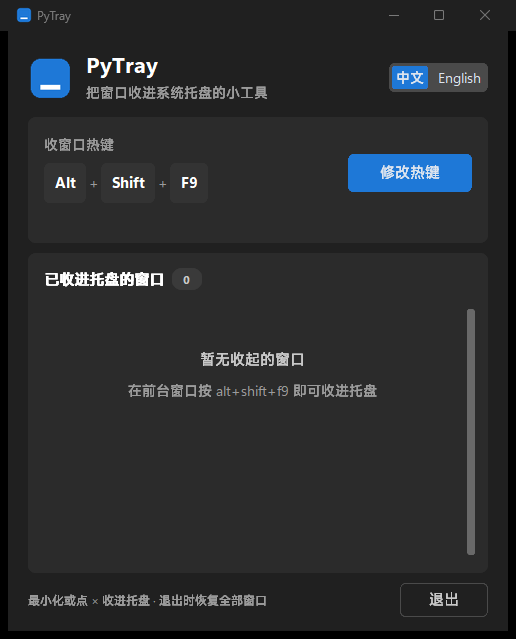

# PyTray

English | **[中文](README.md)**


A small utility that minimizes any window to the system tray with a hotkey —
a lightweight Python reimagining of RBTray. Ships with a modern dark UI,
Chinese/English switching, custom hotkeys, and a live tray-window manager.



## Tribute

This project pays tribute to the classic open-source tool
**[RBTray](https://github.com/benbuck/rbtray)** — created by Nikolay Redko and
J.D. Purcell (1998–2010) and maintained by Benbuck Nason since 2015
([original SourceForge project](https://sourceforge.net/projects/rbtray/)).
PyTray's core behaviors (hotkey minimize-to-tray, tray-icon restore, restoring
all windows on exit, using each window's own icon) follow RBTray as the
blueprint. It is an independent rewrite in Python and contains none of its
code. Full credit and thanks to the original authors.

## Features

- **Tray hotkey**: `Alt+Shift+F9` (default) sends the foreground window to the
  tray — no taskbar residue, with the window's **own icon** and title
- **Restore / close**: click the tray icon to restore; the main window lists
  every hidden window with one-click restore/close
- **Custom hotkey**: press "Change Hotkey" then any combo; conflicts with
  RegisterHotKey-style hotkeys (RBTray, GPU drivers, …) are detected at startup
- **Temporary marks**: give any hidden window a temporary display name and a
  color ring / dot (12 presets, or custom `#RRGGBB` / RGB). Marks are sticky —
  they survive restore and re-hide; cleared only when the window closes or you
  hit "Clear Mark"
- **Bilingual UI**: switch between 中文 and English in one click
- **Hides to tray itself**: minimizing or closing the main window sends it to
  the tray; click the PyTray tray icon to bring it back
- **Safe exit**: quitting restores every hidden window
- Single-instance guard; tray icons are cleaned up automatically when a hidden
  window exits or re-shows itself

## Install

### Option 1: Release build (recommended)

Download `PyTray.exe` from [Releases](../../releases) and double-click it —
no Python required. Keep `PyTray.ico` beside it (optional, for the window icon).

### Option 2: From source

```
setup.bat      # creates venv, installs deps, probes the default hotkey
start.bat      # launch
```

Or manually:

```
python -m venv venv
venv\Scripts\pip install -r requirements.txt
venv\Scripts\pythonw.exe pytray.py
```

## Usage

| Action | How |
|---|---|
| Minimize a window | Press the hotkey (`Alt+Shift+F9` by default) |
| Restore | Click the window's tray icon / "Restore" in the list |
| Close | Tray icon right-click → Close Window / "Close" in the list |
| Change hotkey | "Change Hotkey" → press a new combo (Esc cancels) |
| Rename / color tag | ✎ button in the list row, or tray right-click → Rename / Mark (sticky: survives restore + re-hide; cleared on window close or "Clear Mark") |
| Switch language | 中文 / English toggle, top-right of the main window |
| Reopen main window | Click the PyTray tray icon |
| Quit | Tray right-click → Quit PyTray (restores all windows) |

Hotkey syntax: `modifier+modifier+key`, e.g. `alt+shift+f9`, `ctrl+alt+down`.

One-shot override (not saved): `PyTray.exe ctrl+alt+t`

> **Detection limits**: RegisterHotKey-style conflicts are detected; hotkeys
> implemented via low-level keyboard hooks (AutoHotkey, …) cannot be enumerated
> by any Windows API — verify those by pressing the combo.

## Building the executable

```
venv\Scripts\pip install pyinstaller
build.bat
```

Produces `dist\PyTray.exe` (single file, windowed, icon embedded).

## Development & Testing

```
venv\Scripts\python.exe tests\test_units.py
venv\Scripts\python.exe tests\smoke_test.py
```

Unit tests cover hotkey parsing and mark-color parsing. The smoke test covers
startup, main window visibility, minimize-to-tray, and hotkey minimization of
a target window.

## FAQ

- **Tray icon missing**: Windows 11 hides new icons in the overflow area —
  click `^` near the clock, or enable PyTray under
  Settings → Personalization → Taskbar → Other system tray icons
- **Hotkey not working**: the status line in the main window explains
  conflicts; just pick another combo
- **Fonts & licensing**: the UI references Windows' built-in Segoe UI Variable
  by name only — no font files are bundled or distributed
- **Uninstall**: quit the app and delete `PyTray.exe` / the folder; no
  registry entries, no leftovers

## License

[MIT](LICENSE). This project contains no code from RBTray; see the
[Tribute](#tribute) section.
